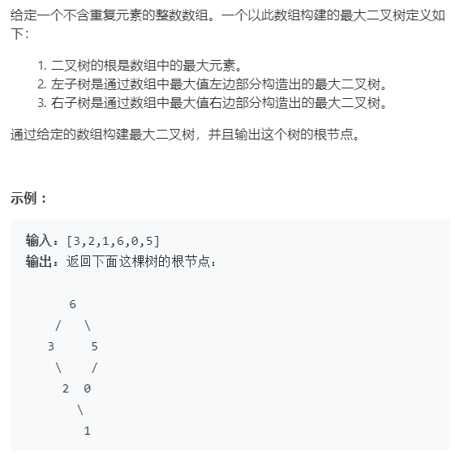

最大二叉树
---
###题目描述




###解决结果


###代码

[代码](../../leetcode/app/src/main/java/top/werls/leetcode/ConstructMaximumBinaryTree.java)

```java
public class ConstructMaximumBinaryTree {
    /**
     * 654 最大二叉树
     */
    public class TreeNode {
        int val;
        TreeNode left;TreeNode right;
        TreeNode(int x) { val = x; }
    }
    public TreeNode constructMaximumBinaryTree(int[] nums) {

     return c(nums,0,nums.length-1);
    }
    public TreeNode c(int[] nums,int left,int right){
        if (left>right){
            return null;
        }
        if (right==0){
            return new TreeNode(nums[left]);
        }
        /*找到最大值的下标*/
        int index=left,Max=nums[left];
        for (int i=left+1;i<=right;i++){
            if (nums[i]>Max){
                Max=nums[i];
                index=i;
            }
        }
        /*划分 ，左边，[left，index) index 为根 右边 ，(index,right]*/
        TreeNode treeNode=new TreeNode(Max);
        treeNode.left=c(nums,left,index -1);
        treeNode.right=c(nums,index + 1,right);
        return treeNode;
    }
}
```